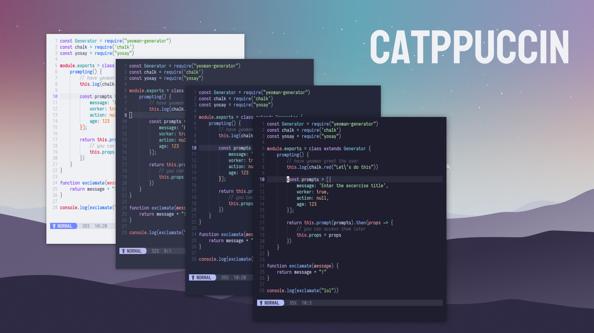

<h3 align="center">
	<br/>
	
	Catppuccin for <a href="https://github.com/neovim/neovim">NeoVim</a>
	
</h3>

<p align="center">
    <a href="https://github.com/catppuccin/nvim/stargazers"></a>
    <a href="https://github.com/catppuccin/nvim/issues"></a>
    <a href="https://github.com/catppuccin/nvim/contributors"></a>
</p>

<p align="center">
  
</p>

# About

This port of Catppuccin is special because it was the first one and the one that originated the project itself. Given this, it's important to acknowledge that it all didn't come to be what it is now out of nowhere. So, if you are interested in knowing more about the initial stages of the theme, you can find it under the [`old-catppuccino`](https://github.com/catppuccin/nvim/tree/old-catppuccino) branch.

# 🎁 Features

-   Handy CLI.
-   Extensible for many use cases.
-   [Compile](https://github.com/catppuccin/nvim#Compile) user's configuration
-   Integrations with a bunch of plugins:
    -   [Treesitter](https://github.com/tree-sitter/tree-sitter)
    -   [Native LSP](https://github.com/neovim/nvim-lspconfig)
    -   [Telescope](https://github.com/nvim-telescope/telescope.nvim)
    -   [Feline](https://github.com/feline-nvim/feline.nvim)
    -   [Lualine](https://github.com/hoob3rt/lualine.nvim)
    -   [Nvim-cmp](https://github.com/hrsh7th/nvim-cmp)
    -   [LSP Saga](https://github.com/tami5/lspsaga.nvim)
    -   [Git signs](https://github.com/lewis6991/gitsigns.nvim)
    -   [Indent Blankline](https://github.com/lukas-reineke/indent-blankline.nvim)
    -   [Trouble](https://github.com/folke/trouble.nvim)
    -   [WhichKey](https://github.com/folke/which-key.nvim)
    -   [BarBar](https://github.com/romgrk/barbar.nvim)
    -   [NvimTree](https://github.com/kyazdani42/nvim-tree.lua)
    -   [Neo-tree](https://github.com/nvim-neo-tree/neo-tree.nvim)
    -   [Git Gutter](https://github.com/airblade/vim-gitgutter)
    -   [Fern](https://github.com/lambdalisue/fern.vim)
    -   [Lightline](https://github.com/itchyny/lightline.vim)
    -   [Dashboard](https://github.com/glepnir/dashboard-nvim)
    -   [Markdown](https://www.markdownguide.org/)
    -   [Lightspeed](https://github.com/ggandor/lightspeed.nvim)
    -   [Nvim-ts-Rainbow](https://github.com/p00f/nvim-ts-rainbow)
    -   [Sneak](https://github.com/justinmk/vim-sneak)
    -   [Hop](https://github.com/phaazon/hop.nvim)
    -   [Neogit](https://github.com/TimUntersberger/neogit)
    -   [Telekasten](https://github.com/renerocksai/telekasten.nvim)
    -   [Notify](https://github.com/rcarriga/nvim-notify)
    -   [Symbols-Outline](https://github.com/simrat39/symbols-outline.nvim)
    -   [Mini.nvim](https://github.com/echasnovski/mini.nvim)

## Usage

You can use your favorite plugin manager for this. Here are some examples with the most popular ones:

#### Vim-plug

```lua
Plug 'catppuccin/nvim', {'as': 'catppuccin'}
```

#### Packer.nvim

```lua
use({
	"catppuccin/nvim",
	as = "catppuccin"
})
```

#### Vundle

```lua
Plugin 'catppuccin/nvim', {'name': 'catppuccin'}
```

### Setup

There are already some sane defaults that you may like, however you can change them to match your taste. These are the defaults:

```lua
dim_inactive = {
  enabled = false
  shade = "dark",
  percentage = 0.15,
},
transparent_background = false,
term_colors = false,
compile = {
	enabled = false,
	path = vim.fn.stdpath "cache" .. "/catppuccin",
	suffix = "_compiled"
},
styles = {
	comments = { "italic" },
	conditionals = { "italic" },
	loops = {},
	functions = {},
	keywords = {},
	strings = {},
	variables = {},
	numbers = {},
	booleans = {},
	properties = {},
	types = {},
	operators = {},
},
integrations = {
	treesitter = true,
	native_lsp = {
		enabled = true,
		virtual_text = {
			errors = { "italic" },
			hints = { "italic" },
			warnings = { "italic" },
			information = { "italic" },
		},
		underlines = {
			errors = { "underline" },
			hints = { "underline" },
			warnings = { "underline" },
			information = { "underline" },
		},
	},
	coc_nvim = false,
	lsp_trouble = false,
	cmp = true,
	lsp_saga = false,
	gitgutter = false,
	gitsigns = true,
	telescope = true,
	nvimtree = {
		enabled = true,
		show_root = true,
		transparent_panel = false,
	},
	neotree = {
		enabled = false,
		show_root = true,
		transparent_panel = false,
	},
	which_key = false,
	indent_blankline = {
		enabled = true,
		colored_indent_levels = false,
	},
	dashboard = true,
	neogit = false,
	vim_sneak = false,
	fern = false,
	barbar = false,
	bufferline = true,
	markdown = true,
	lightspeed = false,
	ts_rainbow = false,
	hop = false,
	notify = true,
	telekasten = true,
	symbols_outline = true,
	mini = false,
}
```

The way you setup the settings on your configuration varies based on whether you are using vimL for this or Lua.

<details>
    <summary>For init.lua</summary>
<p>

```lua
local catppuccin = require("catppuccin")

-- configure it
catppuccin.setup(<settings>)
```

<br />
</details>

<details>
    <summary>For init.vim</summary>
<p>

```lua
lua << EOF
local catppuccin = require("catppuccin")

-- configure it
catppuccin.setup(<settings>)
EOF
```

<br />
</details>

After setting things up, you can load catppuccin like so:

```vim
" Vim Script
let g:catppuccin_flavour = "frappe" " latte, frappe, macchiato, mocha
colorscheme catppuccin
```

```lua
-- Lua
vim.g.catppuccin_flavour = "frappe" -- latte, frappe, macchiato, mocha
vim.cmd[[colorscheme catppuccin]]
```

Remember that if you want to switch your Catppuccin flavour "on the fly" you may use the `:Catppuccin <flavour>` command.

> Note: the command has autocompletion enabled, so you can just press tab to cycle through the flavours

### Configuration

Although settings already have self-explanatory names, here is where you can find info about each one of them and their classifications!

#### General

This settings are unrelated to any group and are independent.

-   `transparent_background`: (Boolean) if true, disables setting the background color.
-   `term_colors`: (Boolean) if true, sets terminal colors (e.g. `g:terminal_color_0`).

#### Dim inactive

This setting manages the ability to dim the inactive splits/windows/buffers displayed.

-   `enabled`: (Boolean) if true, dims the background color of inactive window or buffer or split.
-   `shade`: (string) sets the shade to apply to the inactive split or window or buffer.
-   `percentage`: (number 0 < x < 1) percentage of the shade to apply to the inactive window, split or buffer.

#### Styles

Handles the style of general hi groups (see `:h highlight-args`):

-   `comments`: (String) changed the style of the comments.
-   `functions`: (String) changed the style of the functions.
-   `keywords`: (String) changed the style of the keywords.
-   `strings`: (String) changed the style of the strings.
-   `variables`: (String) changed the style of the variables.

#### Integrations

These integrations allow catppuccin to set the theme of various plugins/stuff. To enable an integration you just need to set it to `true`, however, there are some special integrations...

If you'd like to know which highlight groups are being affected by catppuccin, checkout this directory: [`lua/catppuccin/core/integrations/`](https://github.com/catppuccin/nvim/tree/main/lua/catppuccin/core/integrations).

##### Special Integrations

-   **Feline.nvim**: First make sure that the [kyazdani42/nvim-web-devicons](https://github.com/kyazdani42/nvim-web-devicons/) plugin is installed. Then update your Feline config to use the Catppuccin components:

```lua
require("feline").setup({
	components = require('catppuccin.core.integrations.feline'),
})
```

-   **Indent-blankline.nvim**: setting `enabled` to `true` enables this integration. `colored_indent_levels` enables char highlights per indent level. Follow the instructions [here](https://github.com/lukas-reineke/indent-blankline.nvim#with-custom-gindent_blankline_char_highlight_list) to set the latter up.
-   **Lightline:** use this to set it up (Note: `catppuccin` is the only valid colorscheme name. It will pick the one set in your config):

```lua
let g:lightline = {'colorscheme': 'catppuccin'}
```

-   **Lualine:** use this to set it up (Note: `catppuccin` is the only valid theme name. It will pick the one set in your config):

```lua
require('lualine').setup {
	options = {
		theme = "catppuccin"
		-- ... the rest of your lualine config
	}
}
```

-   **Native Nvim LSP:** setting `enabled` to `true` enables this integration. In the inners tables you can set the style for the diagnostics, both `virtual_text` (what you see on the side) and `underlines` (what points directly at the thing (e.g. an error)).
-   **NvimTree:** setting `enabled` to `true` enables this integration:

```lua
integration = {
	nvimtree = {
		enabled = true,
		show_root = true, -- makes the root folder not transparent
		transparent_panel = false, -- make the panel transparent
	}
}
```

-   **Neo-tree:** setting `enabled` to `true` enables this integration:

```lua
integration = {
	neotree = {
		enabled = true,
		show_root = true, -- makes the root folder not transparent
		transparent_panel = false, -- make the panel transparent
	}
}
```

### Compile

Catppuccin is a highly customizable and configurable colorscheme. This does however come at the cost of complexity and execution time.

Catppuccin can pre compute the results of your configuration and store the results in a compiled lua file. We use these precached values to set it's highlights.

#### Enable

Setting `enabled` to `true` enables this feature:

```lua
compile = {
	enabled = true,
	path = vim.fn.stdpath "cache" .. "/catppuccin",
	suffix = "_compiled"
},
```

By default catppuccin writes the compiled results into the system's cache directory.

#### Compile commands

```bash
:CatppuccinCompile # Create/update the compile file
:CatppuccinClean # Delete compiled file
```

#### Post-install/update hooks
It's recommended to add `:CatppuccinCompile` to post-install/update hooks. For example:

Packer.nvim

```lua
-- It's recommended to add `:CatppuccinCompile` to post-install/update hooks
use {
	"catppuccin/nvim",
	as = "catppuccin",
	run = "CatppuccinCompile",
}
```

Vim-plug

```lua
Plug 'catppuccin/nvim', {'as': 'catppuccin', 'do': 'CatppuccinCompile'}
```

#### Auto compile

Packer.nvim

```lua
-- Create an autocmd `User PackerCompileDone` to update it every time packer is compiled
vim.api.nvim_create_autocmd("User", {
	pattern = "PackerCompileDone",
	callback = function()
		vim.cmd "CatppuccinCompile"
	end,
})
```

Vim-plug

```bash
# Auto compile on save if catppuccin config is in `init.vim`
autocmd BufWritePost init.vim :CatppuccinCompile
```

Acknowledge: [nightfox.nvim#compile](https://github.com/EdenEast/nightfox.nvim#compile)

### Extra

##### Modules

-   `colors`

```lua
require("catppuccin.palettes").get_palette()
```

> Returns a table where the key is the name of the color and the value is its hex value.

#### Overwriting highlight groups

Highlight groups can be overwritten in the setting like so:

```lua
custom_highlights = {
	<hi_group> = { <fields> }
}
```

Here is an example:

```lua
local colors = require("catppuccin.palettes").get_palette() -- fetch colors from palette
custom_highlights = {
	Comment = { fg = colors.flamingo }
	TSConstBuiltin = { fg = colors.peach, style = {} },
	TSConstant = { fg = colors.sky },
	TSComment = { fg = colors.surface2, style = { "italic" } }
}
```

#### Overwriting colors

Colors can be overwritten using `color_overrides` in the setting:

```lua
color_overrides = {
	frappe = {
		text = "#ffffff"
		base = "#ff0000",
		mantle = "#242424",
		crust = "#474747",
	}
},
```

#### Hooks

Use them to execute code at certain events. These are the ones available:

| Function           | Description                  |
| ------------------ | ---------------------------- |
| `before_loading()` | Before loading a colorscheme |
| `after_loading()`  | After loading a colorscheme  |

They can be used like so:

```lua
local catppuccin = require("catppuccin")

catppuccin.before_loading = function ()
	print("I ran before loading Catppuccin!")
end
```

#### Autocmd

Instead of `after_loading` hook, you can use autocmd event like this:

```lua
vim.api.nvim_create_autocmd("User", {
	pattern = "CatppuccinLoaded",
	callback = function()
		local colors = require("catppuccin.api.colors").get_colors()
		-- do something with colors
	end
})
```

## FAQ

#### Transparent background tweak?

Add this to `custom_highlights` settings

```lua
local colors = require("catppuccin.palettes").get_palette()
colors.none = "NONE"
require("catppuccin").setup {
	custom_highlights = {
		Comment = { fg = colors.overlay1 },
		LineNr = { fg = colors.overlay1 },
		CursorLine = { bg = colors.none },
		CursorLineNr = { fg = colors.lavender },
		DiagnosticVirtualTextError = { bg = colors.none },
		DiagnosticVirtualTextWarn = { bg = colors.none },
		DiagnosticVirtualTextInfo = { bg = colors.none },
		DiagnosticVirtualTextHint = { bg = colors.none },
	}
}
```

#### Use catppuccin theme for :set background=light/dark?

The following autocmd will change the flavour to latte when you `:set background=light` and to mocha after `:set background=dark`

```lua
vim.api.nvim_create_autocmd("OptionSet", {
	pattern = "background",
	callback = function()
		vim.cmd("Catppuccin " .. (vim.v.option_new == "light" and "latte" or "mocha"))
	end,
})
```

For people who are hybrid between light and dark mode!

#### Abnormal colors?

You need to enable [truecolor](https://wiki.archlinux.org/title/Color_output_in_console#True_color_support)

Related: [:h termguicolors](https://neovim.io/doc/user/options.html#'termguicolors'), [catppuccin/nvim#182](https://github.com/catppuccin/nvim/issues/182),

## 💝 Thanks to

-   [Pocco81](https://github.com/Pocco81)

&nbsp;

<p align="center"></p>
<p align="center">Copyright &copy; 2021-present <a href="https://github.com/catppuccin" target="_blank">Catppuccin Org</a>
<p align="center"><a href="https://github.com/catppuccin/catppuccin/blob/main/LICENSE"></a></p>
